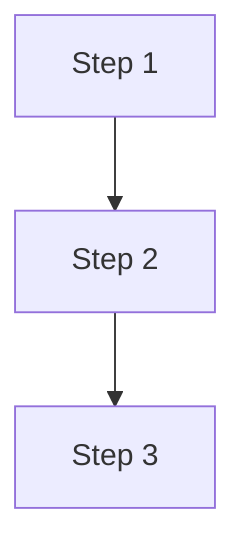

{/*
  Replace every placeholder. Delete sections that do not apply — do not leave
  empty headings. The body must not contain an <h1>; the title above is the
  page title.

  Do not use {curly} or <angle> bracket placeholders in the body — MDX parses
  them as JSX and the build fails. Use plain-text placeholders only.
  */}

One- or two-sentence intro paragraph. State what the page is about. No heading.

---

## Overview

Two to four sentences expanding the intro: what the capability is, what it gives
the user, and how it fits into the surrounding product area. Present tense,
active voice, no marketing language.

---

## When to use

Use this feature in the following scenarios:

- Scenario 1
- Scenario 2
- Scenario 3

---

## How it works

Conceptual model in two to four sentences. If the flow can be drawn as nodes
and edges, prefer mermaid over an image.



{/*
  If the concept needs a static diagram or infographic that mermaid cannot
  render (layered architecture with labels, conceptual map, etc.), and the
  user has provided one, place it under ./assets/img/ and reference it here:

    

  Do not invent file paths. If no image is available and the topic can be
  drawn as a flow, use mermaid above instead.
  */}

---

## Configuration

Use a table when options are enumerable. Use bullets when they aren't.

| Option   | Description                            |
| -------- | -------------------------------------- |
| Option 1 | What it controls and the default value |
| Option 2 | What it controls and the default value |

---

## Example

```text
Working example. Replace the fence language (text / sql / java / json / etc.)
to match the snippet.
```

One or two sentences explaining what the example does and what the reader
should take away from it.

---

## Notes and limitations

:::note
Edge case, gotcha, or database-specific caveat. Use admonitions sparingly.
:::

- Limitation 1
- Limitation 2

---

## Summary

- **Capability 1** — one-line description
- **Capability 2** — one-line description
- **Capability 3** — one-line description

---

## Related

{/*
  Internal links use relative paths from this file, with no .md / .mdx
  extension. Verify each target exists before writing the link.
  */}

- [Sibling reference doc](../relative/path/without/extension)
- [Related how-to guide](/docs/guide/subfolder/slug)
