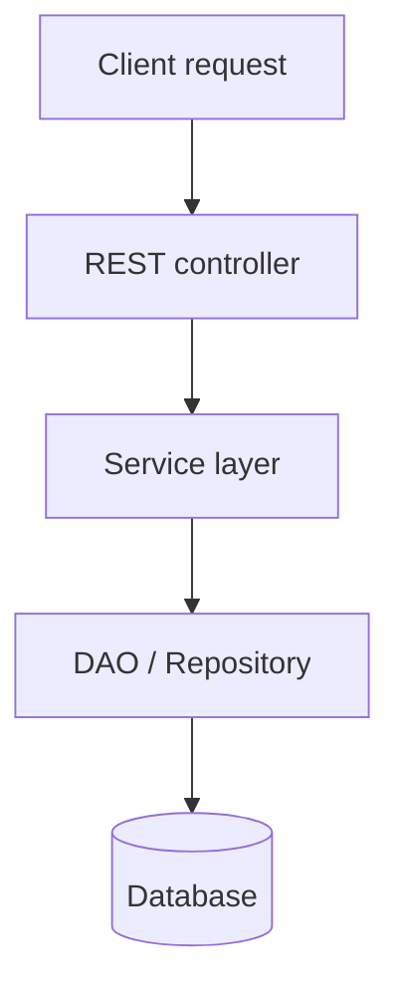

# Core Documentation Conventions

These rules apply to documentation pages under `docs/<section>/...`. They are derived from existing pages (see `docs/apis-and-services/apis/database-and-crud-apis/` for canonical examples) and from `AGENTS.md` / `CONTRIBUTING.md` at the repo root.

If anything here conflicts with `AGENTS.md`, `AGENTS.md` wins. Update this file rather than diverging.

## File and frontmatter

- File extension: `.mdx` preferred; `.md` acceptable for pages with no JSX components.
- Filename: kebab-case, no date prefix. (Date prefixes are only for blog posts and feature announcements.)
- Frontmatter must include `last_update: { author: "Name" }`. Set `title:` for the page title — do not rely on a body `# heading`.
- Optional frontmatter: `sidebar_label`, `tags`. Do not set `id` — Docusaurus derives the doc ID from the file path.

```yaml
---
title: "Stored Procedures"
last_update: { author: "Priyanka Bhadri" }
---
```

## Body structure

The body **must not** open with an `<h1>`. The page title comes from frontmatter. All body headings start at `##`.

A common structural skeleton — adapt to the topic, do not force every section:

| Section             | Purpose                                                                                                                                                     |
| ------------------- | ----------------------------------------------------------------------------------------------------------------------------------------------------------- |
| Intro paragraph     | One or two sentences immediately after frontmatter. State what the page is about. No heading.                                                               |
| Overview            | Optional `## Overview`. The "what and why" in 2–4 sentences. Use this when the intro is not enough.                                                         |
| When to use         | Bulleted scenarios where the feature applies.                                                                                                               |
| How it works        | Conceptual model. Often the right place for a diagram or mermaid flow.                                                                                      |
| Configuration       | Parameters, modes, options, with tables where the options are enumerable.                                                                                   |
| Examples            | Concrete fenced code blocks. Label the language.                                                                                                            |
| Generated artifacts | Specific to platform-generated code. List models, services, controllers with paths.                                                                         |
| Notes / Limitations | Edge cases, gotchas, database-specific caveats. Use `:::note`, `:::warning` admonitions sparingly.                                                          |
| Summary             | Optional `## Summary`. 3–5 bullets recapping the key capabilities.                                                                                          |
| Related             | Links to sibling reference docs and relevant how-to guides. Add only when asked, or suggest it if genuinely useful links exist — do not include by default. |

Section dividers (`---` horizontal rules) are used between major sections in many existing pages. They are optional — match the surrounding files.

## Tone

WaveMaker docs are descriptive and factual. The voice is calm and technical.

| Rule                        | What it means                                                                                    |
| --------------------------- | ------------------------------------------------------------------------------------------------ |
| Present tense               | "WaveMaker generates a controller." Not "will generate", not "has generated".                    |
| Active voice                | "WaveMaker exposes the procedure as a REST API." Not "is exposed by WaveMaker".                  |
| Third person and imperative | "Developers can extend…" or "Configure the parameter…". Use second person ("you") sparingly.     |
| Sentence case for headings  | "Generated services", not "Generated Services".                                                  |
| No marketing language       | Avoid "powerful", "seamless", "exciting", "robust" (unless quoting). Describe what it does.      |
| Define terms once           | Introduce a term, then use it consistently. No synonyms midway.                                  |
| Spell out the first time    | First mention spells out the full name; later mentions can use the short form (REST, JPA, etc.). |

Pulled directly from `apis-and-services/apis/database-and-crud-apis/index.mdx`:

> WaveMaker provides a robust, developer-friendly approach to working with databases. When an application is connected to a database, WaveMaker introspects the complete schema and automatically generates a standardized API layer with CRUD operations.

This is the target voice: declarative, present-tense, capability-focused.

## Visuals — strong preference order

The order is: **mermaid** → **diagram / infographic / illustration** → **screenshot**. Screenshots are the last resort.

### 1. Mermaid (preferred for flows)

Anything that can be drawn as a flow, sequence, state machine, or decision tree goes in a mermaid block:

````markdown

````

Mermaid is rendered inline by Docusaurus. No image file is created. Prefer mermaid for:

- Request / response flows
- Lifecycle and state diagrams
- Decision trees
- Layered architecture (when the layers are nodes with clear directionality)
- Sequence diagrams

### 2. Diagrams, infographics, illustrations (for abstract concepts)

For concepts that mermaid cannot draw cleanly — layered architectures with labels, conceptual relationships, multi-axis comparisons — use a static diagram. The diagram is provided by the user, not generated.

- File goes in the co-located `assets/img/` directory.
- Reference with a relative path: ``.
- Always include descriptive `alt` text.
- Caption the image with a short paragraph before or after explaining what it depicts.

If the user does not have an asset and the concept can be drawn as a flow, **prefer mermaid** over asking the user to produce one.

### 3. Screenshots (only when necessary)

Screenshots are added only when:

- The visual is genuinely necessary (a unique UI element words cannot describe).
- The user explicitly provides one.

Default behavior: **no screenshot**. UI behavior is described in prose; flows are drawn in mermaid; architecture is shown in diagrams.

When a screenshot is unavoidable, follow the same co-location rule (`./assets/img/...`) and write specific `alt` text that describes what the image shows, not the surrounding heading.

## Assets — placement and linking

Per `AGENTS.md`, content-specific assets are **co-located** next to the content, never in `static/img/`.

### Images and GIFs

Co-locate under an `assets/img/` directory next to the `.mdx` / `.md` file:

```text
docs/<section>/<subsection>/
├── my-doc.mdx
└── assets/
    └── img/
        ├── architecture.png
        └── flow.gif
```

Reference with relative paths:

```mdx

```

### Shared assets — nearest common ancestor

If the same asset is referenced from more than one doc, place it in the `assets/img/` directory of the **nearest common ancestor** of those docs, and reference it from each doc with its own relative path.

Example: `section/page-a.mdx` and `section/page-b.mdx` share `architecture.png` → it lives in `section/assets/img/architecture.png`, and both files reference it as `./assets/img/architecture.png`.

When moving or deleting a doc, walk this rule in reverse: if the asset's set of consumers changes, the asset may need to move closer to or further from the remaining consumers.

### Videos

Co-located under `assets/vids/` (see `AGENTS.md`). Most core docs do not embed video — prefer linking to an Academy walkthrough or video using `<AcademyCard>` / `<VideoCard>`.

### Globally shared assets

`static/img/` is reserved for site-wide assets — favicons, logos, header art. Do not place doc-specific images here.

## Links

### Internal links between docs

Use **relative MDX paths**. No `.md` or `.mdx` extension — Docusaurus resolves the extension automatically.

```mdx
[API Explorer](../../../studio/workspaces/api-explorer)
[Database Explorer](../../../studio/workspaces/database-explorer)
[Profiles](../../configurations/profiles)
```

Every relative link must point to a file that exists. Verify before writing:

```sh
ls docs/<resolved-path>.mdx
# or
find docs/ -name '<filename>' -type f
```

### Linking from a doc to a blog post or feature announcement

These live in separate Docusaurus plugin instances. From a `docs/` page, link with a URL path that includes the date segments derived from the filename prefix:

```mdx
[Launch announcement](/feature-announcements/2026/04/21/ask-ai-in-docs)
[Engineering blog post](/blog/2026/04/09/AI-Native-Developer-Intelligence-at-scale)
```

Filename `YYYY-MM-DD-<slug>.mdx` publishes at `/<route>/YYYY/MM/DD/<slug>`. Never link by slug alone.

### External links

Full `https://` URL. Use sparingly — prefer internal links when the content is on-site.

```mdx
[JDBC reference](https://docs.oracle.com/javase/8/docs/technotes/guides/jdbc/)
```

### Anchors

Heading anchors are auto-generated from the heading text in kebab-case. Use them for in-page jumps:

```mdx
[See the configuration section](#configuration)
```

### Common link mistakes

| Mistake                                   | Fix                                                           |
| ----------------------------------------- | ------------------------------------------------------------- |
| `[link](../foo.mdx)` (extension included) | `[link](../foo)`                                              |
| `[link](#)` (placeholder)                 | Verify and add the real link, or omit it.                     |
| `[link](/docs/foo)` from another doc      | Use relative path `../foo` from docs to docs.                 |
| `[blog](/blog/my-post)` (no date)         | `/blog/YYYY/MM/DD/my-post`.                                   |
| Stale link to a moved doc                 | When moving a doc, search for and rewrite every inbound link. |

## MDX components and admonitions

### Admonitions

```mdx
:::note
A neutral aside.
:::

:::tip
A useful suggestion.
:::

:::warning
A caveat that could cause problems if ignored.
:::

:::danger
A destructive or irreversible action.
:::
```

Use sparingly. Most content should be in the body flow, not boxed.

### Globally registered components

These are wired in `src/theme/MDXComponents/index.js` and available in every `.mdx` file without an import:

- `<AcademyCard>` — interactive walkthroughs.
- `<VideoCard>` — Academy video embed.
- `<Pill>`, `<PillGroup>` — platform pills (used heavily in release notes).
- `<Accordian>` — expandable section (used in release notes).
- `<TabsWrapper>` — tabbed sections.

Do not `import` these — it causes redeclaration errors.

### Comments

Use the MDX expression form for comments. HTML comments fail the MDX build:

```mdx
{/* This comment is fine in .mdx. */}
```

### Placeholders

`<Your text here>` in an MDX body is parsed as a JSX element and breaks the build. Use plain-text placeholders (`{{title}}`, `[title]`) or wrap examples inside `{/* ... */}`.

## Sidebar wiring

Every new doc needs an entry in the matching `sidebar/sidebars/<area>Sidebar.js`. A doc with no sidebar entry is published but unreachable from navigation.

Prefer, in order:

1. `npm run manage-docs` — the interactive CLI handles insertion, naming variants, and rollback.
2. Helpers from `scripts/doc-manager.mjs`.
3. Direct edit — only for small, obvious changes (reordering, label typos, single-entry removal).

Entry format:

```js
{
  type: 'doc',
  id: '<section>/<subpath>/<filename-without-extension>',
  label: '<Short label>',  // optional; falls back to frontmatter title
},
```

The `id` must match the file path relative to `docs/`, without the `.md` / `.mdx` extension. A mismatch silently breaks the entry.

For a category whose own landing page is a doc (common pattern), the category uses a `link` property:

```js
{
  type: 'category',
  label: 'Database & CRUD APIs',
  link: {
    type: 'doc',
    id: 'apis-and-services/apis/database-and-crud-apis/index',
  },
  items: [
    { type: 'doc', id: 'apis-and-services/apis/database-and-crud-apis/generated-apis' },
    { type: 'doc', id: 'apis-and-services/apis/database-and-crud-apis/queries-and-procedures' },
  ],
},
```

## Move / rename / delete checklist

Use this as a working checklist when relocating or removing a doc:

- [ ] Identified every inbound reference (search by current path with and without extension, and by sidebar `id`).
- [ ] Listed every owned asset (images, GIFs, videos referenced from this doc).
- [ ] Checked each asset for other consumers; flagged shared assets.
- [ ] Presented the full plan to the user before changing anything.
- [ ] Moved or deleted the file.
- [ ] Moved exclusive assets with the file (or deleted them on delete).
- [ ] Left shared assets in place unless their nearest common ancestor changed.
- [ ] Rewrote every inbound link to the new path.
- [ ] Updated the sidebar entry (new `id`, new label, or removed entirely).
- [ ] Cleaned up any now-orphaned asset files and any empty `assets/img/` directories.
- [ ] `npm run lint` passes.
- [ ] `npm run build` passes.

## Examples — recognising the WaveMaker voice

These short excerpts are the calibration target. New writing should sit alongside them naturally.

### Intro paragraph (no heading)

> WaveMaker provides a robust, developer-friendly approach to working with databases. When an application is connected to a database, WaveMaker introspects the complete schema and automatically generates a standardized API layer with CRUD operations.

(Note: "robust" appears here because this is a direct quote from an existing page. Do not copy the word — it predates the style guide. Use it to calibrate sentence rhythm and structure only.)

### Capability list

> Once a database is connected, WaveMaker automatically generates CRUD APIs for selected tables and views. These APIs:
>
> - Follow REST conventions
> - Support pagination, sorting, and filtering
> - Include commonly used APIs such as `getByUniqueKey`, `ExportToExcel`, aggregated data APIs, and more
> - Are production-ready and consumable by client applications

### When-to-use list

> Use database queries in the following scenarios:
>
> - When CRUD APIs do not meet the required data logic
> - When joining multiple tables is required
> - When aggregation or calculated fields are needed
> - When data must be filtered dynamically at runtime
> - When paginated or exportable result sets are required

### Generated artifacts (code-block tree)

> ```text
> services/
> └── hrdb/
>     ├── designtime/
>     └── src/
>         └── com/myapp/hrdb/
>             ├── controller/       # REST controllers for procedure execution
>             ├── models/procedure/ # Generated request and response POJOs
>             └── service/          # Procedure execution services
> ```

### Notes / admonition

> :::note
> Queries must be executed successfully before they can be saved.
> :::

### Summary

> Database queries in WaveMaker enable implementing custom data access logic while automatically exposing that logic as REST APIs.
>
> **Key capabilities:**
>
> - **Custom data access** beyond standard CRUD operations
> - **Automatic REST API generation** for all saved queries
> - **Direct integration** with UI components and backend services
> - **Layered architecture** with models, services, and controllers
> - **Export functionality** for paginated queries
