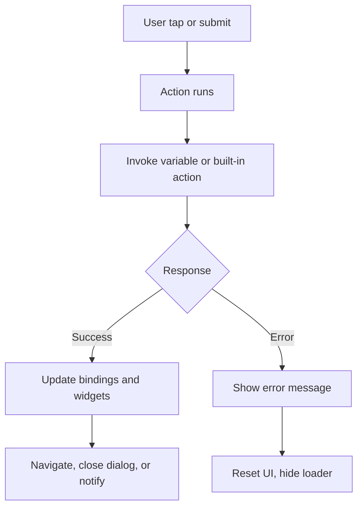
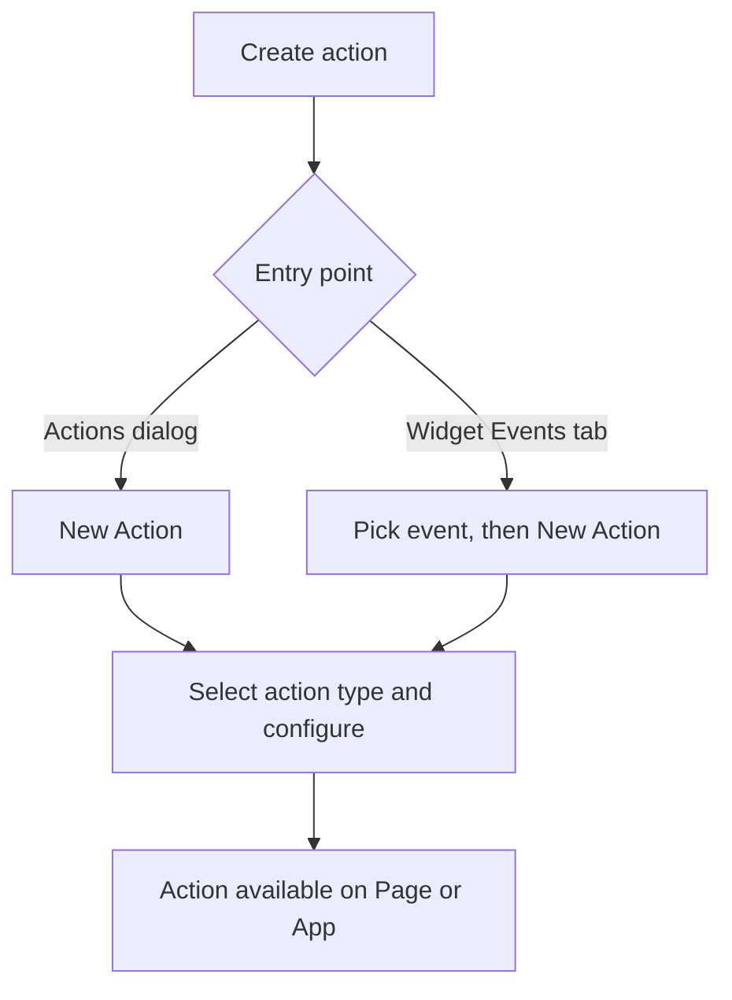

# Overview

Variables and **Actions** connect the UI to backend services and navigation. Variables load and bind data. Actions run the next step when something happens: invoke a service, show a message, open a page, or log in.

Actions keep business logic out of widget markup. You wire them from the **Actions** dialog or from a widget **Events** tab (for example **on Tap** or **on Submit**).

## When actions run

- **User events:** button tap, form submit, list row select
- **System events:** success or error after a variable or action completes

For event handler naming and UI callbacks, see [Event handling overview](/docs/user-interfaces/mobile/develop/events/).

## Create an action

**From the Actions dialog**

1. Open **Actions** in Studio.
2. Click **New Action**.
3. Pick the action type (navigation, notification, login, and so on).

**From a widget event**

1. Select the widget.
2. Open the **Events** tab.
3. Choose an event (for example **on Tap**) and click **New Action**.
4. Complete the **New Action** dialog.

## Action types

Studio provides navigation, login, logout, timer, and notification actions. Configuration and `invoke()` examples are on [Types of actions](/docs/user-interfaces/mobile/develop/actions/types).

## Related topics

- [Types of actions](/docs/user-interfaces/mobile/develop/actions/types)
- [Event handling overview](/docs/user-interfaces/mobile/develop/events/)
- [Variable events](/docs/user-interfaces/mobile/develop/events/variable-events)
- [UI events](/docs/user-interfaces/mobile/develop/events/ui-events)
