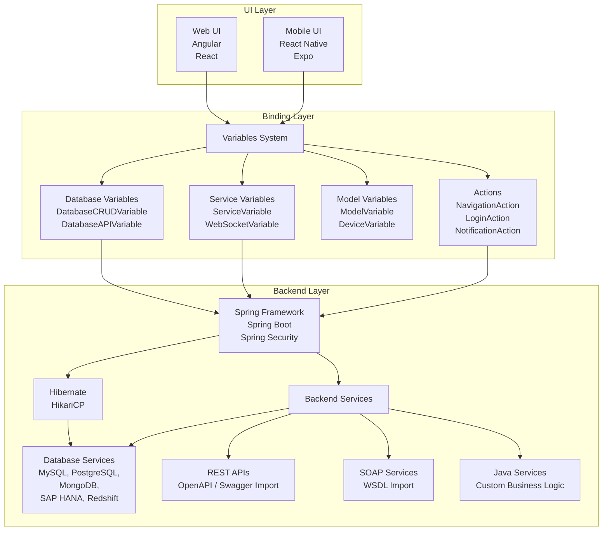

# Overview

WaveMaker projects follow a standard Maven structure with parent POM inheritance. For mobile, the platform generates an Expo-based React Native project. The generated project can be built into APK (Android) or IPA (iOS) using WaveMaker CLI or AppChef.

### Core Structure

- Maven-based with parent POM inheritance: WaveMaker-app-parent → WaveMaker-app-dependencies → your app's pom.xml
- Default profiles: development and deployment; custom profiles supported
- Build outputs:
  - Expo-based React Native project (exported as ZIP)
  - APK (Android) via WaveMaker CLI or AppChef
  - IPA (iOS) via WaveMaker CLI or AppChef

```text
project/
├── src/main/
│   ├── java/          # Java service classes
│   ├── resources/     # Configuration files, queries
│   └── webapp/        # UI and app config root (Maven folder name; used in mobile and web projects)
│       ├── pages/     # Page markup, scripts, styles
│       ├── services/  # Backend service metadata
│       ├── app.css    # Application-level styles
│       ├── app.js     # Application-level scripts
│       └── app.variables.json  # Application variables
├── pom.xml            # Maven build configuration
├── package.json       # NPM dependencies
└── profiles/          # Environment-specific configurations
```

### Three-Layer Application Architecture

WaveMaker applications follow a strict three-layer architecture that separates concerns between presentation, data binding, and business logic. You create either a **web** or a **mobile** project in Studio—not both in one project. The diagram shows both client types at a platform level; your mobile project uses only the **Mobile UI** branch.


