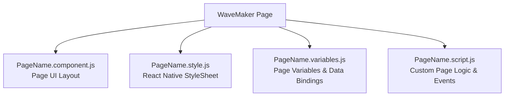

# Working with Generated React Native Code

WaveMaker generates an Expo-based React Native project from your **mobile** project's design-time source in Studio (pages, variables, and configuration)—not from a web project. The generated code follows React Native conventions while preserving WaveMaker's runtime engine, data bindings, and page composition model. The generated code is modular, readable and production ready.

**Key characteristics of the generated React Native code include:**

- **Component Based Page Architecture:** Each WaveMaker page is generated as a self-contained module under `src/pages/` with the following structure:
  - A React Native component file (`PageName.component.js`) that defines the page UI layout
  - A page-specific stylesheet (`PageName.style.js`) using React Native StyleSheet
  - A script file (`PageName.script.js`) for page behavior and lifecycle hooks
  - A variable definition file (`PageName.variables.js`) for page state, service bindings, and data flow

- **WaveMaker Runtime Integration**: The generated React Native components are bound to the WaveMaker runtime. The runtime layer manages:
  - Page lifecycle (initialization, ready state, teardown)
  - Two-way data binding between UI components and variables
  - Service invocation and response mapping
  - Navigation and event wiring

- **Expo Configuration**: The generated project uses Expo for native module management. `app.json` defines the Expo configuration and `wm_rn_config.json` provides WaveMaker-specific settings including plugin registrations and feature flags.

### Generated Project Structure

```text
project-expo-app/
├── App.js                    # Application entry point
├── app.json                  # Expo configuration
├── app.style.js              # Application-level styles
├── app.theme.js              # Theme configuration
├── package.json              # NPM dependencies and scripts
├── babel.config.js           # Babel configuration
├── metro.config.js           # Metro bundler configuration
├── bootstrap.js              # Runtime bootstrap
├── wm_rn_config.json         # WaveMaker plugin and feature configuration
├── font.config.js            # Custom font configuration
│
├── assets/                   # Static assets (images, fonts, icons)
│
├── src/
│   ├── app.variables.js      # Application-level variables and service bindings
│   ├── device-permission-service.js
│   ├── device-plugin-service.js
│   ├── pages/                # Generated page modules
│   │   ├── pages-config.js   # Page routing configuration
│   │   ├── Main/
│   │   │   ├── Main.component.js    # Page UI layout
│   │   │   ├── Main.script.js       # Page logic and event handlers
│   │   │   ├── Main.style.js        # Page styles (React Native StyleSheet)
│   │   │   └── Main.variables.js    # Page variables and data bindings
│   │   ├── Login/
│   │   └── ...
│   ├── partials/             # Reusable partial page fragments
│   ├── prefabs/              # Prefab components
│   └── extensions/           # Custom extensions
│
├── theme/                    # Design token theme files
├── scripts/                  # Build and utility scripts
└── android/                  # Native Android project (generated by prebuild)
```

### Page Module Structure

Each WaveMaker page is generated as a standalone module. UI, logic, state, and styles are split across separate files.



### Studio Markup to Generated Code

WaveMaker Markup (WML) defined in Studio:

```html
<wm-page name="mainpage">
    <wm-mobile-navbar name="mobile_navbar1" title="Title" backbutton="false">
        <wm-anchor caption="" name="AddLink" iconclass="wi wi-gear"></wm-anchor>
    </wm-mobile-navbar>
    <wm-content name="content1">
        <wm-left-panel content="leftnav" name="left_panel1"></wm-left-panel>
        <wm-page-content columnwidth="12" name="page_content1">
            <wm-button class="btn-custom" caption="Button" type="button"
                name="button1" variant="custom"></wm-button>
        </wm-page-content>
    </wm-content>
    <wm-mobile-tabbar name="mobile_tabbar1"></wm-mobile-tabbar>
</wm-page>
```

Generated React Native code:

```javascript
const PC_Page_content1 = ({ fragment }) => {
  return (
    <WmPageContent columnwidth={12} name="page_content1" listener={fragment}>
      <WmButton caption="Button" type="button" name="button1"
        variant="filled:default" listener={fragment} />
    </WmPageContent>
  );
};

export default class MainPage extends BasePage {
  constructor(props) {
    super(props);
    this.name = 'Main';
    this.theme = props.themeToUse || this.appConfig.theme;
    this.theme = this.theme.$new('Main-styles', styles);
  }

  init() {
    const data = getVariables(this.proxy);
    this.fragmentVariables = data.Variables;
    this.fragmentActions = data.Actions;
    addPageScript(this.App, this.proxy);
  }

  renderPage() {
    const fragment = this.proxy;
    return (
      <AssetProvider value={this.provideAsset}>
        <PC_Mainpage fragment={fragment} />
      </AssetProvider>
    );
  }
}
```
