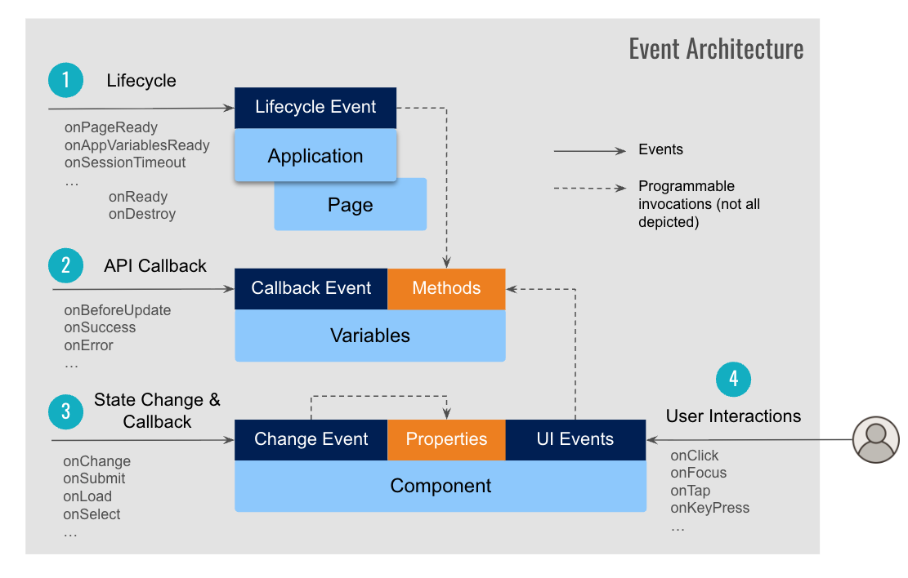

# Overview

WaveMaker mobile apps use a layered, event-driven model. **Pages**, **Variables**, and **UI components** expose events for lifecycle, data changes, and user actions. Use events to run logic before and after API calls, react when screens gain or lose focus, and handle taps and input on widgets.

## Event types

There are four broad categories of events:

1. Application and page lifecycle events
2. Variable invocation callback events for pre- and post-processing on API calls
3. UI component state change and callback events tied to component behavior (forms, lists, and similar)
4. UI events for user interaction with components (shown on the right in the diagram below)

## Application and page lifecycle events

**App-level events** run for the whole application at startup, when global variables are ready, on session timeout, and on service errors. Use them for one-time setup, configuration, or cleanup.

- `onPageReady`
- `onAppVariablesReady`
- `onSessionTimeout`
- `onServiceError`

See [Application and page events](/docs/user-interfaces/mobile/develop/events/app-page-events) for details and examples.

**Page-level events** run for an individual screen during navigation, focus, and teardown. **On Attach** and **on Detach** align with navigation **focus** and **blur** when pages are cached.

- `onReady`
- `onAttach`
- `onDetach`
- `onDestroy`
- `onResize`: viewport size changes; callback `data` can include `screenWidth` and `screenHeight`
- `onOrientationchange`: portrait versus landscape; same `data` shape as **on Resize** when present

Wire **on Resize** and **on Orientation Change** on the page root in markup, not on child widgets. For sample handlers and when each event fires, see [Application and page events](/docs/user-interfaces/mobile/develop/events/app-page-events#page-events). Page cache and refresh behavior are in [Page properties](/docs/user-interfaces/mobile/develop/page/properties).

## Variable invocation callback events

Variables wrap REST (and similar) services and expose hooks around each invocation. Use them to transform request or response data before the UI updates.

- `onBeforeUpdate`
- `onResult`
- `onBeforeDatasetReady`
- `onSuccess`
- `onError`

See [Variable events](/docs/user-interfaces/mobile/develop/events/variable-events).

## Component state change and callback events

Many components expose events tied to their behavior, such as form submit, list selection, or chip add and remove. These are not the same as tap or focus UI events.

Not every component has state events. A **Button** typically uses the **on Tap** UI event for interaction, while a **Toggle** exposes **on Change** when its value changes.

- `onChange`
- `onSubmit`
- `onLoad`
- `onSelect`
- `onBeforeLoad`, and others per widget

Check the widget in Studio or the [React Native component docs](https://react-components.wavemaker.ai/?path=/story/basic-anchor--docs#tab-events) for the full list on a given component.

## UI events across components

**Component-specific UI events** fire when the user interacts with a widget: tap, press, focus, blur, or text input. Available events depend on the component (button, form field, list, and so on).

Common patterns on mobile:

- `onTap` (primary touch event on buttons, anchors, lists, and most tappable widgets)
- `onFocus`, `onBlur`
- `onChange` (for inputs)
- `onKeypress`, `onKeyup` (where the widget supports keyboard input, for example in web preview or connected hardware keyboards)

See [UI events](/docs/user-interfaces/mobile/develop/events/ui-events) and the component Storybook **Events** tab for handlers and naming in scripts.

## Related topics

- [Application and page events](/docs/user-interfaces/mobile/develop/events/app-page-events)
- [Variable events](/docs/user-interfaces/mobile/develop/events/variable-events)
- [UI events](/docs/user-interfaces/mobile/develop/events/ui-events)
- [Page properties](/docs/user-interfaces/mobile/develop/page/properties): page parameters, cache, and refresh on attach
