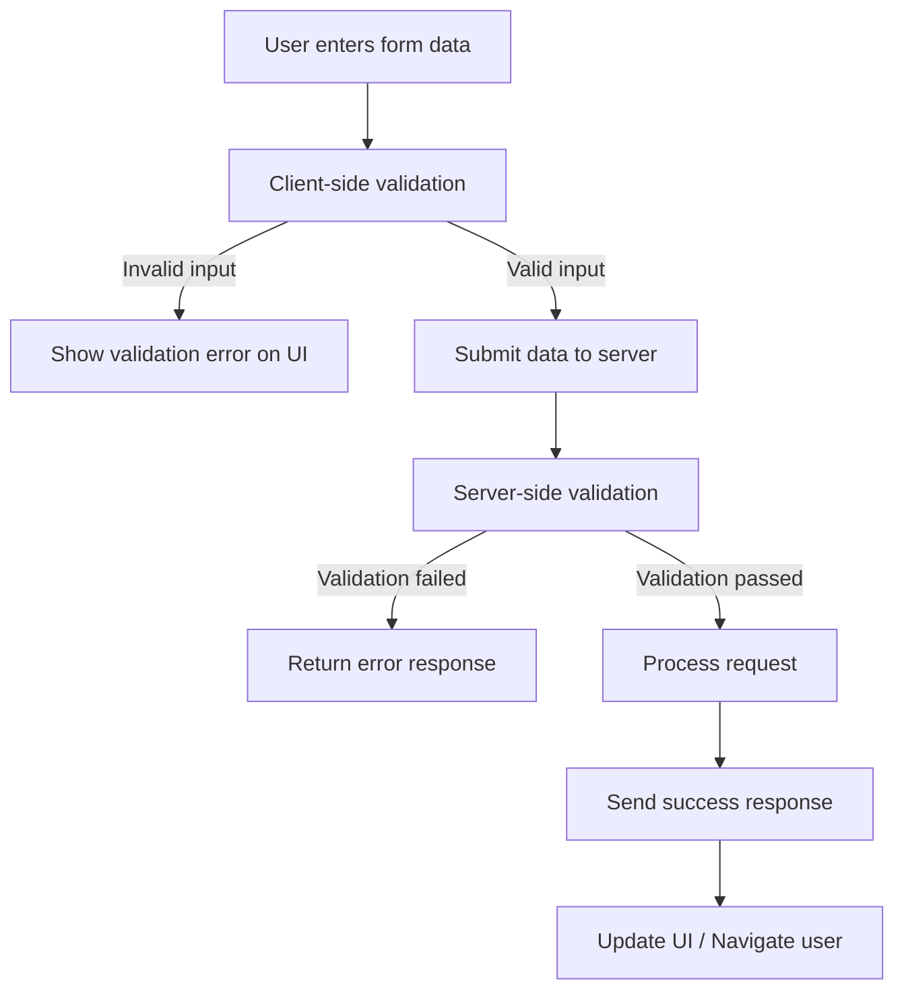
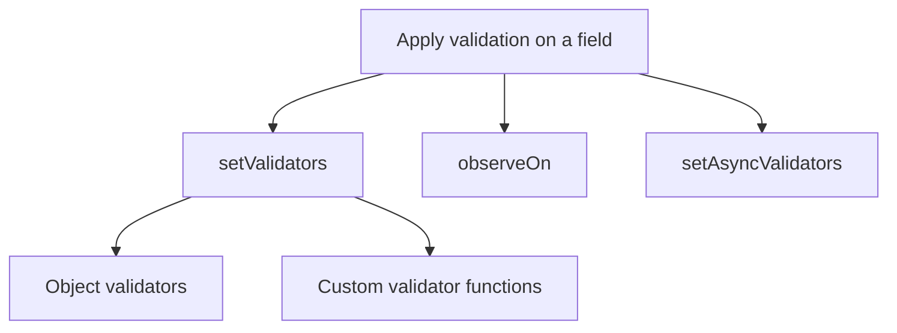

# Validation Flow in an Application

Validation is a standard feature in mobile applications. When users fill out a form, the app can point out missing or incorrect input right away. For example:

- **This field is required** — the user must enter a value before continuing
- **Phone number must be in xxx-xxxx format** — the value must match a pattern
- **Password must include a number, symbol, and uppercase letter** — custom rules must be met

**Client-side validation** runs in the app as the user edits the form. **Server-side validation** runs on the backend when data is submitted.



## How validation works in WaveMaker

WaveMaker provides built-in validation so you can define rules and messages without writing everything from scratch. On mobile, validation is handled in the UI through **validator functions** on **form fields** (`wm-form` / `wm-liveform`).

Add validation in the page **Script** tab in Studio (or in the Properties panel for common rules). When you run or preview the app, the same rules run when the user interacts with the form.

You can validate a single field or coordinate several fields using:

- `setValidators`
- `observeOn`
- `setAsyncValidators`

### Validator types

Use `App.getDependency('CONSTANTS').VALIDATOR` for built-in validator types:

| Validator    | Validator type           |
| ------------ | ------------------------ |
| required     | `VALIDATOR.REQUIRED`     |
| maxchars     | `VALIDATOR.MAXCHARS`     |
| minvalue     | `VALIDATOR.MINVALUE`     |
| maxvalue     | `VALIDATOR.MAXVALUE`     |
| regexp       | `VALIDATOR.REGEXP`       |
| mindate      | `VALIDATOR.MINDATE`      |
| maxdate      | `VALIDATOR.MAXDATE`      |
| excludedates | `VALIDATOR.EXCLUDEDATES` |
| excludedays  | `VALIDATOR.EXCLUDEDAYS`  |
| mintime      | `VALIDATOR.MINTIME`      |
| maxtime      | `VALIDATOR.MAXTIME`      |

There are three ways to apply validation on a field:



### setValidators

Call `setValidators` on a form field. Pass an array of:

- **Objects** for built-in validators (`VALIDATOR.REQUIRED`, `VALIDATOR.REGEXP`, and so on)
- **Functions** for custom validation

#### Object validators

These validations include built-in rules such as required, min value, max value, and regexp. To apply required validation on a form field:

1. Open the page **Script** tab in Studio.
2. In `Page.onReady` (or another event after the form is available), get the validator constants: `var VALIDATOR = App.getDependency('CONSTANTS').VALIDATOR;`
3. Call `setValidators` on the form field with a required validator object.

```javascript
var VALIDATOR = App.getDependency('CONSTANTS').VALIDATOR;

Page.Widgets.employeeForm.formfields.lastName.setValidators([{
  type: VALIDATOR.REQUIRED,
  validator: true,
  errorMessage: "This field cannot be empty."
}]);
```

#### Custom validators using functions

To add a custom validator function:

1. Define a function that receives `(field, form)` and returns `{ errorMessage }` when validation fails.
2. Register it with `setValidators` on the target form field.
3. Call `setValidators` from `Page.onReady` or when the form is available on the page.

```javascript
Page.Widgets.employeeForm.formfields.lastName.setValidators([lastNameVal]);

function lastNameVal(field, form) {
  if (field.value && field.value.length < 2) {
    return {
      errorMessage: "Enter your full name."
    };
  }
}
```

#### Objects and custom functions together

Email must be present and match a pattern:

```javascript
var VALIDATOR = App.getDependency('CONSTANTS').VALIDATOR;

Page.Widgets.employeeForm.formfields.email.setValidators([
  emailRequired,
  {
    type: VALIDATOR.REGEXP,
    validator: /\w+@\w+\.\w{2,3}/,
    errorMessage: "Not a valid email"
  }
]);

function emailRequired(field, form) {
  if (!field.value || field.value.length < 1) {
    return {
      errorMessage: "Email cannot be empty."
    };
  }
}
```

### observeOn

`observeOn` takes an array of **other form field names**. When any of those fields change, this field’s validators run again. Use it for cross-field rules (for example password and confirm password).

```javascript
Page.Widgets.employeeForm.formfields.confirmpassword.setValidators([confirmPasswordEval]);
Page.Widgets.employeeForm.formfields.confirmpassword.observeOn(['password']);

function confirmPasswordEval(field, form) {
  const errorMessage = "Password and confirm password must match.";
  if (field.value && form.formfields.password.value !== field.value) {
    return { errorMessage };
  }
}
```

### setAsyncValidators

`setAsyncValidators` accepts functions that **return a Promise**. Use it when validation must wait on data (for example checking a list variable or a service).

```javascript
Page.Widgets.employeeInfoForm.formfields.email.setAsyncValidators([emailAsync]);

function emailAsync(field, form) {
  if (!field.value) {
    return Promise.resolve();
  }
  return new Promise(function (resolve, reject) {
    var emailExists = Page.Variables.EmailData.dataSet.filter(function (data) {
      return data.dataValue === field.value;
    });
    if (emailExists.length !== 0) {
      reject({
        errorMessage: "The email address is already registered."
      });
    } else {
      resolve();
    }
  });
}
```

Call `setValidators`, `observeOn`, and `setAsyncValidators` from page lifecycle events (for example `Page.onReady`) or from an action such as a button tap, depending on when the form is available.
