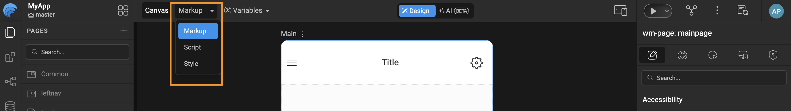

# Page Elements

In WaveMaker, every page is designed and managed through the **Canvas**. On the top-left corner of the Canvas, you'll find a dropdown with three options: **Markup, Script, and Style**. These options represent the core building blocks of a WaveMaker page and define how a page is structured and managed.



- **Markup:** The Markup view contains the UI structure of the page

  - It includes all WaveMaker components that are dragged and dropped onto the canvas (such as lists, charts, containers, forms, etc.).
  - This section defines how the page looks structurally and how components are laid out.

  ```html
      <!-- Main Page Markup -->
      <wm-page name="mainpage">
          <wm-mobile-navbar name="mobile_navbar1" title="Title" backbutton="false">
              <wm-anchor caption="" name="AddLink" iconclass="wi wi-gear"></wm-anchor>
          </wm-mobile-navbar>
          <wm-content name="content1">
              <wm-left-panel content="leftnav" name="left_panel1"></wm-left-panel>
              <wm-page-content columnwidth="12" name="page_content1"></wm-page-content>
          </wm-content>
          <wm-mobile-tabbar name="mobile_tabbar1"></wm-mobile-tabbar>
      </wm-page>
  ```
- **Script:** The Script view is used for page level and component level logic.

  - Any JavaScript logic written for handling events, data manipulation, validations, or custom behaviors is added here.
  - This includes lifecycle hooks, event handlers, and custom functions related to the page.

  ```JavaScript
      Page.onReady = function () {
          Page.Variables.svProfileData.invoke();
          Page.Widgets.userButton.caption = "Steve Harrington";
      };

      Page.submitTap = function ($event, widget) {
          Page.Actions.goToPage_Main.invoke();
      };
  ```
- **Style:** The Style view is dedicated to page level styling.

  - CSS rules specific to the page, such as layout adjustments, colors, fonts, or overrides are defined here.
  - These styles apply only to the current page and do not affect other pages in the application.
  - For mobile, styles are converted to React Native StyleSheet at build time.

  ```css
      .app-button {
          background-color: #0B868D;
          color: white;
          padding: 12px 24px;
          font-size: 16px;
          border-radius: 8px;
      }
  ```

To switch between these views, simply select the required option (**Markup, Script, or Style**) from the dropdown on the top-left of the Canvas.

---

## Page Level Project Structure

For each page created in WaveMaker Studio, the platform generates a set of four related files within the project structure. These files work together to define the page's layout, behavior, styling, and configuration. Each file serves a specific purpose, enabling a clean separation of concerns and making the page easier to develop, customize, and maintain.

```text
     src/
     └── main/
         └──── webapp/
               └─── pages/
                     └─── Main/
                          ├── Main.css
                          ├── Main.html
                          ├── Main.js
                          └── Main.variables.json
```

- **Main.css:** Contains all the CSS styles defined in the Style tab for page-level styling.
- **Main.html:** Contains all the markup defined in the Markup tab, including the UI components added to the page.
- **Main.js:** Contains all the JavaScript logic written in the Script tab, including event handlers and custom functions.
- **Main.variables.json:** Stores metadata related to page variables, such as service variables, model variables and configurations.

---

## Page Overview

In **WaveMaker App**, a page represents a complete UI view within an application. You can create any number of pages in an app, and each page follows a defined layout structure that ensures consistency, responsiveness and ease of development across the application.

The mobile page layout is divided into four sections: **Mobile Navbar, Content (with Left Panel and Page Content), and Mobile Tabbar**.

By default, WaveMaker generates a standard page markup that follows the below structure, which can be customized based on application requirements.

```html
    <!-- Default Mobile Page Markup -->
    <wm-page name="mainpage">
        <wm-mobile-navbar name="mobile_navbar1" title="Title" backbutton="false">
            <wm-anchor caption="" name="AddLink" iconclass="wi wi-gear"></wm-anchor>
        </wm-mobile-navbar>
        <wm-content name="content1">
            <wm-left-panel content="leftnav" name="left_panel1"></wm-left-panel>
            <wm-page-content columnwidth="12" name="page_content1"></wm-page-content>
        </wm-content>
        <wm-mobile-tabbar name="mobile_tabbar1"></wm-mobile-tabbar>
    </wm-page>
```

### Mobile Navbar

The **Mobile Navbar** appears at the top of the page and provides navigation and contextual actions. In a **web** project, the comparable pattern is a header partial; mobile projects use the navbar instead.

It commonly contains:

- Page title
- Back button for navigation
- Action anchors (settings, search, notifications)

The navbar also controls the drawer button for toggling the left panel.

```html
    <wm-mobile-navbar name="mobile_navbar1" title="Title" backbutton="false">
        <wm-anchor caption="" name="AddLink" iconclass="wi wi-gear"></wm-anchor>
    </wm-mobile-navbar>
```

### Left Panel

The **Left Panel** serves as a navigation drawer that slides in from the side. It provides users with quick access to important sections without interrupting the main content area.

Typical use cases include:

- **Navigation menus:** Used to render primary or secondary navigation structures, enabling routing between pages or application sections.
- **Contextual tools and actions:** Filters, action buttons, shortcuts, or utilities relevant to the current page.

  ```html
      <!-- Left Panel Partial Markup -->
      <wm-partial name="leftnav" type="left-panel">
          <wm-nav type="pills" layout="stacked" name="nav1">
              <wm-nav-item name="nav_item1">
                  <wm-anchor caption="Dashboard" iconclass="wi wi-bar-graph" name="anchor1"
                      on-tap="Actions.goToPage_Main.invoke()"></wm-anchor>
              </wm-nav-item>
              <wm-nav-item name="nav_item2">
                  <wm-anchor caption="Pending Orders" iconclass="wi wi-file" name="anchor2"
                      on-tap="Actions.goToPage_Orders.invoke()"></wm-anchor>
              </wm-nav-item>
          </wm-nav>
      </wm-partial>
  ```

### Content

The **Content** section forms the main body of the page where most user interactions occur. For mobile, the content area contains the **Page Content** section.

#### Page Content

The **Page Content** area is the primary workspace of the page. It contains the core UI components and business functionality, such as:

- Layouts and UI Components
- Charts and dashboards
- Forms and lists

This area dynamically updates based on user interactions and data bindings and usually occupies the majority of the available screen space.

### Mobile Tabbar

The **Mobile Tabbar** is located at the bottom of the page and provides tab-based navigation between primary sections of the application. In a **web** project, the comparable pattern is a footer partial; mobile projects use the tabbar instead.

```html
    <wm-mobile-tabbar name="mobile_tabbar1"></wm-mobile-tabbar>
```

The tabbar items are configured through the application's navigation settings in Studio.

---

### Page Operations

You can duplicate, rename and delete a page using the page operations. These can be accessed from the more options against a given page.

- **Renaming** a page or a partial page leads to the page name being renamed, with the new name given by you. All the references are also renamed.
- **Duplicating** a page leads to a copy of the page or partial page being created, with the new name given by you. A new goTo action for that page is also created.
- **Deleting** a page removes all references to the selected page from the project.

---

### Page Name Validations

When creating a page, the following naming conventions should to be followed.

- The page name should contain at least one character, and it cannot be a number.
- The page name cannot contain special characters.
- The page name cannot start with a number.

---

### Home Page Configuration

Every WaveMaker application has a **Home Page**. This allows flexible control over the app's entry point without changing navigation logic.

- The page named **Main** is set as the homepage by default.
- You can customize the default homepage from App Settings, Select the desired page from the Homepage dropdown.

<VideoCard videoUrl="https://academy.wavemaker.ai/Watch?wm=55311449F7" title="Create a Page in WaveMaker" description="Watch for a step-by-step guide on creating and managing pages in WaveMaker Studio." thumbnailText="Create Page" />
