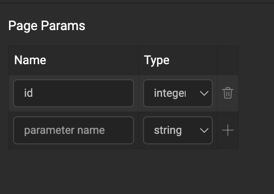
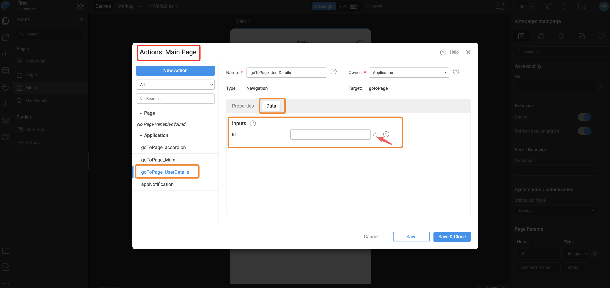

# Properties and Events

Page properties define how a page behaves, appears, and interacts with the application lifecycle. These settings control performance, data handling, and page-level configuration.

- Cache
- Refresh Data on Attach
- Page Title
- Page Params

### Cache

By default, when a user navigates away from a page, the page instance is destroyed to free up memory and resources. When **Cache** is enabled, the page instance is preserved in memory instead of being deleted. This allows the application to restore the page when the user navigates back, including UI state, variable values, and scroll position.

### Refresh Data on Attach

When **Refresh data on attach** is true and a cached page instance is shown again, all startup variables configured to load data on page startup run again. If the page includes partials and prefabs, their startup variables are invoked as well. By default, this flag is **true**.

You can use **On Attach** to refresh specific data instead by invoking the variables you choose.

### Page Title

Page title is the display name associated with the page in runtime. Depending on layout, it may be shown in UI such as **Mobile Navbar** (`title`). It does not update the browser document title in the same way as a WaveMaker web app.

### Page Params

Pass data from one page to another within the app using **Page Params**. This applies to pages and partial pages.

#### How parameters work

Navigation passes parameters through the route as key-value pairs alongside the destination page name.

A typical resolved route fragment looks like this:

```text
#/Pagename
```

After Page Params (for example **userId** and **existingUser**) are defined and navigation supplies values:

```text
#/UserDetails?userId=1&existingUser=true
```

Multiple parameters are supported. Values are carried on the navigation action and surfaced on the receiving page scope for bindings and scripts.

:::note Web preview vs device

During web preview inside Studio, URLs may resemble a hosted web app; on device, parameters still map to navigation route params (`route.params`), not HTTP query strings sent to a server.

:::

#### Steps to adding Page Params

There are two aspects to adding Page Params.

- **Parameterized page:** The page that needs input defines page-level parameters to hold incoming values so you can use them when loading data or driving the UI.
- **Calling page:** The page navigating to the parameterized page (for example **Main**) invokes a Navigation Action and binds argument values—for example **`id`**—from that page's widgets or variables via the Actions **Data** tab.

#### Example

UserDetails needs an **id** to load data and is invoked from Main with that value.

##### Parameterised page

From the Page Properties panel, add parameter fields on the parameterized page by giving each a Name and Type.



Parameters are available in page or partial scope. Use them from the **Page Param** tab in the binding dialog.

##### Calling page

Use the Application-scoped Navigation Action that WaveMaker generates by default for UserDetails when authoring **Main** (for example **goToPage\_UserDetails**). Open the Actions panel on Main, select that navigation action, and on the **Data** tab bind **id** (or whichever page parameter you declared) using widgets or variables on Main. You can also define another Navigation Action for a different navigation flow.



---

#### High-Level Flow

<div style={{ display: 'flex', justifyContent: 'center', margin: '2rem 0' }}>
  ```mermaid
  %%{init: {'theme': 'default', 'flowchart': {'nodeSpacing': 20, 'rankSpacing': 25}}}%%
  flowchart TD
      A[Main Page]
      B[goToPage_UserDetails]
      C["#/UserDetails?id=101"]
      D[UserDetails Page]
      E[API Call]
      F[Data Rendered]

      A -->|id=101| B
      B --> C
      C --> D
      D --> E
      E --> F
  ```
</div>

### Events

WaveMaker exposes page-level lifecycle and viewport events (`onReady`, `onAttach`, `onDetach`, `onDestroy`, `onOrientationchange`, `onResize`) in the React Native runtime so you can run custom logic at the right time. **Cache** and **Refresh data on attach** above affect when **on Attach** and **on Detach** fire.

For when each event runs, full sample handlers (including `onDetach` cleanup and orientation or resize `data`), and scripting patterns, see [Application and page events](../events/app-page-events#page-events).
