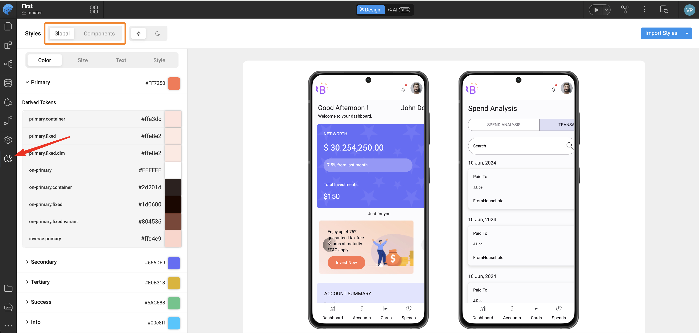
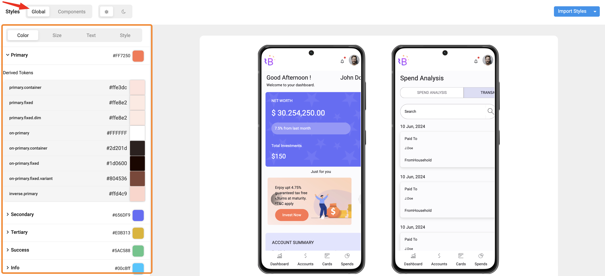
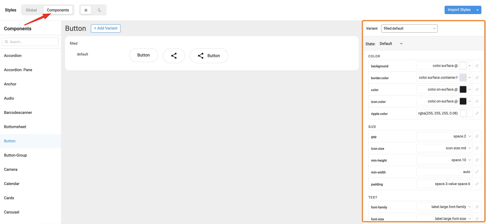

The **Style Workspace** in WaveMaker Studio is the visual editor for design tokens, variants, and component styles. For what each token layer means, see [Design token architecture](./design-token-architecture). For compiled output and export paths, see [Customising your application](./customising-your-application).

You can:

- Browse and edit **[Global Tokens](#1-global-tokens)** (colors, typography, spacing, radius, shadow).
- Expand **[Components](#2-component-tokens)** (Button, Input, Card, etc.) to update their specific tokens.
- Switch between **Appearances**, **Variants**, and **States** to fine-tune the visual style.

## Navigating the Style Workspace

To open the Style Workspace:

1. Open your app in **WaveMaker Studio**.
2. Select **Style Workspace** from the left sidebar.
3. The workspace loads **Global Tokens** by default.



### Key Navigation Areas

| Area                                  | Description                                                                                 |
| ------------------------------------- | ------------------------------------------------------------------------------------------- |
| **Global Tokens Panel**               | Displays foundational design properties like color, font, spacing, radius, and shadows.     |
| **Components Panel**                  | Lists all UI components (Button, Input, Card, etc.) that use tokens from the design system. |
| **Preview Area**                      | Shows real-time changes as you edit tokens.                                                 |
| **Appearance / Variant / State Tabs** | Allow you to define how a component looks, behaves, and adapts in different contexts.       |

### Appearances, Variants, and States

| Category       | Description                                         | Example                |
| -------------- | --------------------------------------------------- | ---------------------- |
| **Appearance** | Defines the overall component style.                | Filled, Outlined, Text |
| **Variant**    | Represents the purpose or hierarchy of a component. | Primary, Secondary     |
| **State**      | Shows how a component responds to interaction.      | Active, Disabled       |

## Editing Tokens (Color, Size, Typography)

You can edit both **Global Tokens** and **Component Tokens** directly within the Style Workspace.\
All edits are instantly reflected in the live preview. When you change colors, compare **light** and **dark** appearances in the preview so contrast stays balanced.

### 1. Global Tokens

**Examples:**

- `color.primary`
- `font.family.brand`
- `space.2`, `space.4`
- `radius.sm`

When you update a global token, every component that references it updates automatically in the preview.

#### How to Edit

1. Expand a token group (e.g., **Colors**, **Typography**).
2. Click on a token value (e.g., `color.primary`).
3. Adjust it using the **color picker**, **dropdown**, or **numeric input**.
4. The **preview area** instantly updates to reflect your changes.



### 2. Component Tokens

Edit tokens for a specific widget family (for example **Button**). Component tokens **inherit** from global tokens for consistency or **override** them locally when you need a widget-specific look. See [Design token architecture](./design-token-architecture#2-component-tokens-the-applied-layer).

#### How to Edit

1. Expand a component accordion (e.g., **Button**).
2. Navigate to token groups such as **Color**, **Size**, and **Text**.
3. Modify a token value.
4. Observe real-time updates in the preview panel.



## Saving and Viewing Generated JSON

Every change made in the **Style Workspace** is automatically saved as a **JSON entry** in your project’s `overrides` folder.\
These JSON files form the **single source of truth** for all your design decisions.

**Folder Structure:**

```
src/main/webapp/design-tokens/overrides/
├── global/ → Global token definitions (colors, typography, spacing)
├── components/ → Component-specific overrides (button, card, input)
```

**Examples:**

- Editing `color.primary` updates:\
  `overrides/global/colors/color.light.json`
- Changing a **Button background** updates:\
  `overrides/components/button/button.json`

For how overrides are compiled and applied in Studio preview and your exported mobile app, see [Customising your application](./customising-your-application#under-the-hood).
