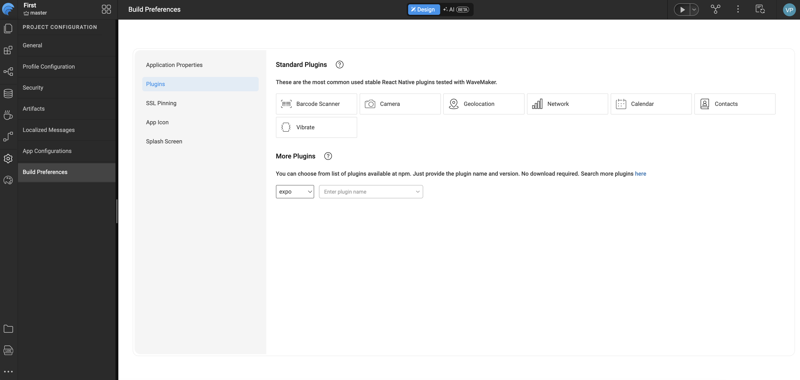

# Third-party Expo plugins

WaveMaker mobile apps are **React Native (Expo)** projects. Native capabilities come from **Expo modules** and compatible npm packages that you register in Studio. WaveMaker does **not** use Cordova or Capacitor for this stack.

Use this guide when you need APIs beyond built-in widgets and device variables (for example `expo-battery`, `expo-haptics`, or a community Expo module).

## Configuration files

| File                    | What it does                                                         | Where it exists                                                                                                                                                                                                                |
| ----------------------- | -------------------------------------------------------------------- | ------------------------------------------------------------------------------------------------------------------------------------------------------------------------------------------------------------------------------ |
| **`wm_rn_config.json`** | **Plugins** you add in Studio (package names and versions).          | `src/main/webapp/wm_rn_config.json` — edited through **Build Preferences → Plugins**.                                                                                                                                          |
| **`app.json`**          | Expo settings such as native permission messages and `expo.plugins`. | **Studio:** optional — upload under `webapp` if you need extra settings. **Not** in the default project tree. **Local project:** `app.json` at the root of **`generated-expo-app`** when you work with the generated Expo app. |

**When to use which**

- Add or remove a package → **Build Preferences → Plugins** (updates **`wm_rn_config.json`**).
- Custom native permission text or an Expo config plugin (for example Face ID message) → upload **`app.json`** in Studio, or edit **`app.json`** in **`generated-expo-app`**.
- Use the package in UI logic → page or partial **Script** with `require('package-name')`.

Built-in device features (camera, location, contacts, calendar, barcode scan, file upload, and similar) work through the matching **widgets** or **device variables** without adding them under **More Plugins**.

---

## Add plugins in Studio

In the left navigation, open **Project Configuration**, select **Build Preferences**, then open the **Plugins** tab.



The **Plugins** tab sits alongside **Application Properties**, **SSL Pinning**, **App Icon**, and **Splash Screen** under **Build Preferences**.

### Standard plugins

Under **Standard Plugins**, toggle the built-in options WaveMaker tests with the mobile stack, including:

- Barcode Scanner
- Camera
- Geolocation
- Network
- Calendar
- Contacts
- Vibrate

These are Expo packages WaveMaker already supports for common device features.

### More plugins (four sources)

Under **More Plugins**, choose a source from the dropdown (for example **expo**), then add package details. You can also search the npm registry from the link on that screen.

| Source    | Use for                                                             | What you provide                                                           |
| --------- | ------------------------------------------------------------------- | -------------------------------------------------------------------------- |
| **Expo**  | Modules from the [Expo SDK](https://docs.expo.dev/versions/latest/) | Pick from the typeahead; Studio adds `name` and `spec` (version).          |
| **npm**   | Any package on the npm registry                                     | Package **name** and **version** (for example `expo-battery` and `9.0.1`). |
| **Git**   | A package installed from a Git repository                           | Package **name** and the **GitHub repository URL** (see below).            |
| **Local** | A package as a compressed `.tgz` archive of its source              | Package **name** and upload the **`.tgz` file** in Studio.                 |

**Git example:** Use the repository URL with a `.git` suffix (not a `/tarball/` link):

`https://github.com/react-native-webview/react-native-webview.git`

**Local example:** A `.tgz` file is a compressed archive of a package’s source code. Upload that file in the **Local** row after you enter the package name.

Save **Build Preferences** so `wm_rn_config.json` includes your plugins:

```json
{
  "plugins": [
    { "name": "expo-battery", "spec": "9.0.1", "variable": [] }
  ]
}
```

---

## Use a plugin in page script

Call the module from a page or partial **Script** tab. WaveMaker page scripts use CommonJS `require`.

### Example: `expo-battery`

**Markup** (labels to show the value):

```html
<wm-page name="mainpage">
  <wm-mobile-navbar name="mobile_navbar1" title="Battery demo" backbutton="false"></wm-mobile-navbar>
  <wm-content name="content1">
    <wm-page-content name="page_content1">
      <wm-label name="labelBattery" caption="0"></wm-label>
    </wm-page-content>
  </wm-content>
</wm-page>
```

**Script:**

```javascript
const Battery = require('expo-battery');

Page.onReady = function () {
  Page.updateBatteryLevel();
};

Page.updateBatteryLevel = async function () {
  const level = await Battery.getBatteryLevelAsync();
  Page.Widgets.labelBattery.caption = String(level);
};
```

Test on a **device or simulator** in your generated Expo app. Some APIs do not behave the same in Studio web preview.

### Platform checks

Many Expo modules run only on iOS and Android. Guard web preview with `Platform.OS`:

```javascript
const Battery = require('expo-battery');
const { Platform } = require('react-native');

Page.onReady = function () {
  if (Platform.OS !== 'web') {
    Page.updateBatteryLevel();
  }
};
```

---

## Permissions and native settings

Turning on a plugin in **Build Preferences** registers the package in **`wm_rn_config.json`**. Some modules also need extra native settings (for example why the app uses the camera or Face ID). Those settings belong in **`app.json`**, not in the **Plugins** tab.

| What you need                                                     | Where to set it                                                        |
| ----------------------------------------------------------------- | ---------------------------------------------------------------------- |
| Install the npm package                                           | **Build Preferences → Plugins** → **`wm_rn_config.json`**              |
| iOS permission messages, Android permissions, Expo config plugins | **`app.json`** — upload in Studio, or edit in **`generated-expo-app`** |

Follow the Expo module’s documentation for the exact **`app.json`** entries (for example `expo.plugins` with a `faceIDPermission` message on iOS).

When users first open camera, location, or contacts in the app, the phone still shows the normal **Allow / Don’t allow** dialog. That is expected and is not replaced by editing **`wm_rn_config.json`** or **`app.json`**.

---

## Practices

- Prefer **Expo** or WaveMaker **standard** plugins before arbitrary npm packages.
- Match **package versions** to your app’s Expo SDK (see [Expo SDK compatibility](https://docs.expo.dev/versions/latest/)).
- Test on **real devices** for hardware APIs (battery, sensors, camera).
- Some packages need a full native app build and do not work in Expo Go alone. See [Mobile build overview](/docs/build-and-deploy/build/mobile/overview) when you need a development or release build.

---

## Related documentation

- [Offline support](./offline-support.md)
- [Mobile build overview](/docs/build-and-deploy/build/mobile/overview)
- [WMX components](/docs/user-interfaces/mobile/enterprise-capabilities/wmx/)
- [Expo SDK reference](https://docs.expo.dev/versions/latest/)
